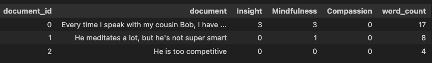
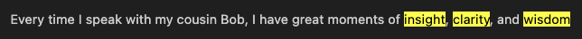
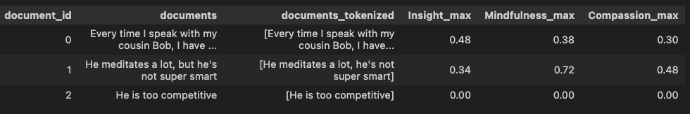
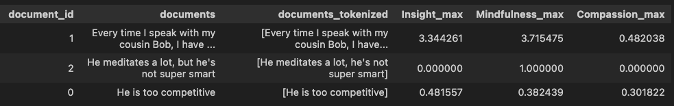

# construct-tracker
Track and measure constructs, concepts or categories in text documents. Built on top of litellm to interactive with Generative AI models. 


# Installation

```bash
pip install construct-tracker
```

# Quick usage

[](https://colab.research.google.com/github/danielmlow/construct-tracker/blob/daniels_branch/tutorials/construct_tracker.ipynb)

# 1. Create a lexicon: keywords prototypically associated to a construct

We want to know if these documents contain mentions of certain construct "insight"

```python
documents = [
 	"Every time I speak with my cousin Bob, I have great moments of clarity and wisdom", # mention of insight
 	"He meditates a lot, but he's not super smart" # related to mindfulness, only somewhat related to insight
	"He is too competitive"] #not very related
```

Choose model [here](https://docs.litellm.ai/docs/providers) and obtain an API key from that provider. Cohere offers a free trial API key, 5 requests per minute. I'm going to choose GPT-4o:

```python
os.environ["OPENAI_API_KEY"]  = 'YOUR_OPENAI_API_KEY'
gpt4o = "gpt-4o-2024-05-13"
```

Two lines of code to create a lexicon
```python
l = lexicon.Lexicon()         # Initialize lexicon
l.add('Insight', section = 'tokens', value = 'create', source = gpt4o)
```

See results:
```python
print(l.constructs['Insight']['tokens'])
```
```
['acuity', 'acumen', 'analysis', 'apprehension', 'awareness', 'clarity', 'comprehension', 'contemplation', 'depth', 'discernment', 'enlightenment', 'epiphany', 'foresight', 'grasp', 'illumination', 'insightfulness', 'interpretation', 'introspection', 'intuition', 'meditation', 'perception', 'perceptiveness', 'perspicacity', 'profoundness', 'realization', 'recognition', 'reflection', 'revelation', 'shrewdness', 'thoughtfulness', 'understanding', 'vision', 'wisdom']
```

We'll repeat for other constructs ("Mindfulness", "Compassion"). Now count whether tokens appear in document:

```python
feature_vectors, matches_counter_d, matches_per_doc, matches_per_construct  = lexicon.extract(
	documents, 
	l.constructs,
	normalize = False)

display(feature_vectors)
```



<!-- ```
|   Insight |   word_count |
|----------:|-------------:|
|         0 |            4 |
|         2 |           17 |
|         0 |            8 |
``` -->
This traditional approach is perfectly interpretable. The first document contains three matches related to insight. Let's see which ones with `highlight_matches()`:


```python
lexicon.highlight_matches(documents, 'Insight',show_n_sentences, matches_construct2doc)
```





<!-- ```python
print(matches_per_doc)
{0: {'Insight': (0, [])},
 1: {'Insight': (2, ['clarity', 'wisdom'])},
 2: {'Insight': (0, [])}}
``` -->
<br><br>

# 2. Construct-text similarity (CTS): finding similar phrases to tokens in your lexicon

### Like Ctrl+F on steroids!
Lexicons may miss relevant words if not contained in the lexicon (it only counts exact matches). Embeddings can find semantically similar tokens. CTS will scan the document and return how similar is the most related phrase to any word in the lexicon. 

<!-- magick -density 300 docs/images/cts.pdf -background white -alpha remove -quality 100 docs/images/cts.png -->


It will vectorize lexicon tokens and document tokens (e.g., phrases) into embeddings (quantitivae vector representing aspects of meaning). Then it will compute the similarity between both sets of tokens and return the maximum similarity as its score for the document. 


```python
lexicon_dict = my_lexicon.to_dict()

features, documents_tokenized, lexicon_dict_final_order, cosine_similarities = cts.measure(
    lexicon_dict,
    documents,
    )
	
display(features)
```


So we see that even though compassion did not find an exact match it had some relationship to the first two documents. 


<!-- You can also sum the exact counts with the similarities for more fine-grained scores. 

 -->

We provide many features to add/remove tokens, generate definitions, validate with human ratings, and much more (see `tutorials/construct_tracker.ipynb`)

[](https://colab.research.google.com/github/danielmlow/construct-tracker/blob/daniels_branch/tutorials/construct_tracker.ipynb)

# Structure of the lexicon object

Each construct is a dict. You can save a lot of metadata for each construct:

```python
my_lexicon.constructs = {
	'Insight': {
		
		'variable_name' # a name that is not sensitive to case with no spaces
		'prompt_name': 'insight',
		'variable_name': 'insight',
		'domain': 'psychology',
		'examples': ['insight', 'realized'],
		'definition': Insigh,
 'definition_references': None,
 'tokens': ['acuity',
  'acumen',
  'aha moment',
		'tokens': ['insight', 'realized', ...] # final list after all additions and removals
		'
	}


	
}


```

### Contributing and pull requests

See `docs/contributing.md`

