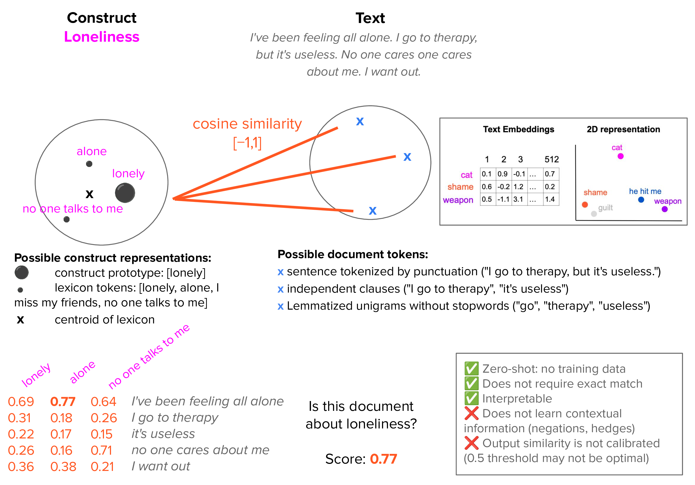

# construct-tracker
Track and measure constructs, concepts or categories in text documents. Built on top of litellm to interactive with Generative AI models. 


# Installation

```bash
pip install construct-tracker
```

# Quick usage

# 1. Create a lexicon: keywords prototypically associated to a construct

We want to know if these documents contain mentions of certain construct "insight"

```python
documents = [
 	"Every time I speak with my cousin Bob, I have great moments of clarity and wisdom", # mention of insight
 	"He meditates a lot, but he's not super smart" # related to mindfulness, only somewhat related to insight
	"He is too competitive"] #not very related
```

Choose model [here](https://docs.litellm.ai/docs/providers) and obtain an API key from that provider. Cohere offers a free trial API key, 5 requests per minute. I'm going to choose GPT-4o:

```python
os.environ["OPENAI_API_KEY"]  = 'YOUR_OPENAI_API_KEY'
gpt4o = "gpt-4o-2024-05-13"
```

Two lines of code to create a lexicon
```python
l = lexicon.Lexicon()         # Initialize lexicon
l.add('Insight', section = 'tokens', value = 'create', source = gpt4o)
```

See results:
```python
print(l.constructs['Insight']['tokens'])
```
```
['acuity', 'acumen', 'analysis', 'apprehension', 'awareness', 'clarity', 'comprehension', 'contemplation', 'depth', 'discernment', 'enlightenment', 'epiphany', 'foresight', 'grasp', 'illumination', 'insightfulness', 'interpretation', 'introspection', 'intuition', 'meditation', 'perception', 'perceptiveness', 'perspicacity', 'profoundness', 'realization', 'recognition', 'reflection', 'revelation', 'shrewdness', 'thoughtfulness', 'understanding', 'vision', 'wisdom']
```

Now count whether tokens appear in document:
```python
feature_vectors, matches_counter_d, matches_per_doc, matches_per_construct  = lexicon.extract(documents,
                                                                                      l.constructs,
                                                                                      normalize = False,
                                                                                      )
display(feature_vectors)
```
```
|   Insight |   word_count |
|----------:|-------------:|
|         0 |            4 |
|         2 |           17 |
|         0 |            8 |
```
The second document contains two matches related to Insight. This traditional approach is perfectly interpretable. Let's see which ones:
```python
print(matches_per_doc)
{0: {'Insight': (0, [])},
 1: {'Insight': (2, ['clarity', 'wisdom'])},
 2: {'Insight': (0, [])}}
```


# 2. Construct-text similarity: finding similar phrases to tokens in your lexicon -- like Ctrl+F on steroids!
Lexicons may miss relevant words if not contained in the lexicon. Embeddings can find similar tokens. Vectorize lexicon tokens and document tokens (e.g., phrases) into embeddings. Compute similarity between both sets of tokens. Return maximum similarity. 

<!-- magick -density 300 docs/images/cts.pdf -quality 100 docs/images/cts.png -->


<!--  -->

```python
feature_vectors_lc, cosine_scores_docs_lc = cts.measure(
      lexicon_dict = lexicon_dict,
      documents = documents,
    )
```


# Structure of the lexicon object

```python
my_lexicon.constructs = {
	'Insight': {
		'variable_name' # a name that is not sensitive to case
		'tokens': ['insight', 'realized', ...] # final list after all additions and removals
		'
	}
}
```

### Contributing and pull requests

See `docs/contributing.md`

